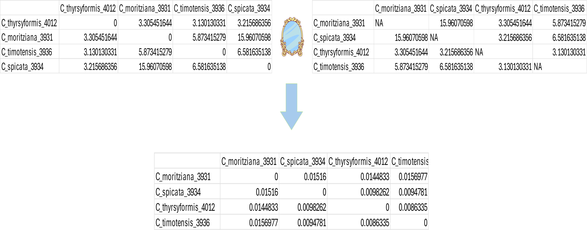

## **Introduction**

The following code takes two distance matrices with the same row and column names but different data. It aligns one matrix to match the order of the other, allowing both matrices to be used in relational analysis. In this case, one matrix contains metric index values, while the other holds evolutionary distance values between species. Both matrices are ordered identically to facilitate their use in subsequent analyses. This alignment ensures that the matrices reflect each other, creating a "mirror image" that supports precise comparative analysis (Figure 1).

```{r eval=FALSE}

# Load the two matrices
distance_matrix <- read.csv("path/to/your/DistM.csv", row.names = 1)

evolutionary_distance_matrix <- read.csv("path/to/your/Evolutionary_Distances.csv", row.names = 1)

# Get the order of rows and columns from distance_matrix
order <- row.names(distance_matrix)

# Reorder the evolutionary distance matrix according to the obtained order
ordered_evolutionary_distance_matrix <- evolutionary_distance_matrix[order, order]

# Save the ordered evolutionary distance matrix to a new CSV file
write.csv(ordered_evolutionary_distance_matrix, "path/to/your/Ordered_Evolutionary_Distances.csv")


```

...

```{r echo=FALSE, fig.align='center', fig.cap="*Figure 1. Illustration of the transformation where one matrix is mirrored with respect to the other, resulting in two matrices ordered identically.*", out.width='100%'}


```
